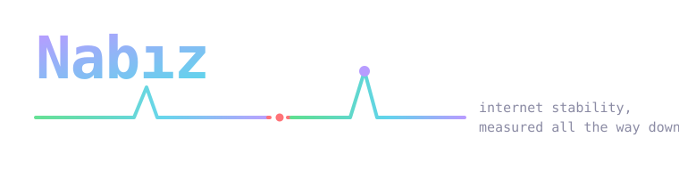
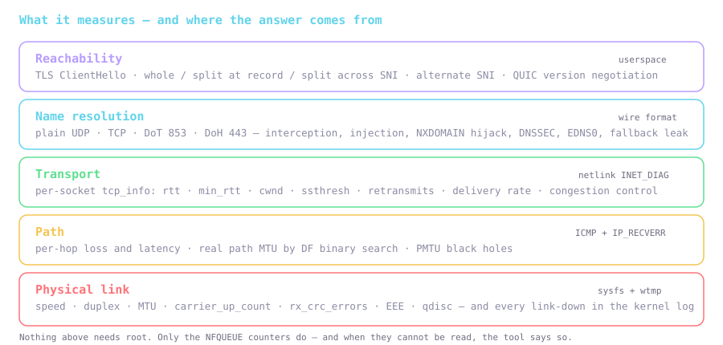
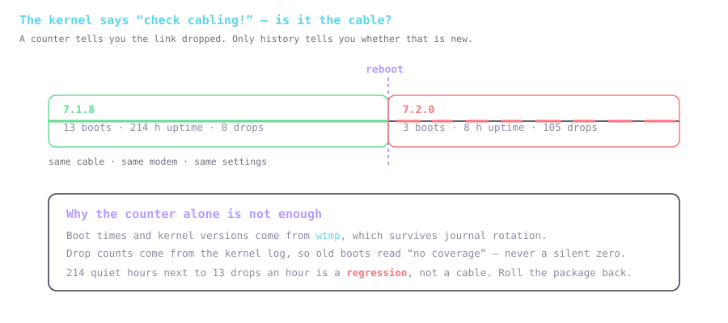
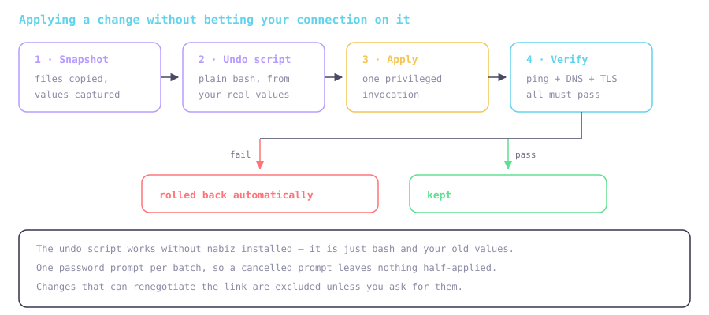
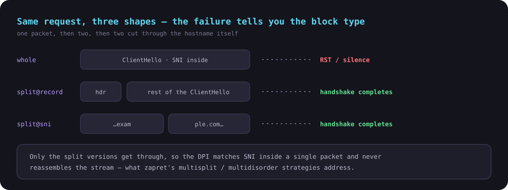

<div align="center">



**Find *where* your connection breaks, *how long* it lasts, *whose fault* it is —
and *which change actually helped*.**

[](https://go.dev)
[](https://github.com/charmbracelet/bubbletea)
[](#the-interface)
[](#no-root-needed)
[](#language)
[](#)
[](LICENSE)

</div>

---

Speed-test sites say your connection is fine while Discord still drops, the game
still rubber-bands and pages still hang halfway. Nabız fills that gap.

One static binary, no runtime dependencies, no root. It also knows about the two
things that quietly rewrite your networking behind your back:
**[bpftune](https://github.com/oracle/bpftune)**, the kernel auto-tuner, and
**[Unwall](https://github.com/WinTone01/Unwall)** / zapret, the DPI-bypass stack.

```bash
go install github.com/WinTone01/nabiz/cmd/nabiz@latest

nabiz doctor    # a diagnosis in under a second, without sending a packet
nabiz           # the full interface
```

## The interface

A real application in the terminal: a grouped sidebar, clickable buttons,
checkboxes and dialogs, a command palette on `ctrl+k` — and every action also on
a key. It adapts: the sidebar becomes a strip of shortcuts on a narrow terminal,
and the two-column pages fold into one.

```
  NABIZ  0.3.1  │  Overview                   enp3s0 100M · 6.18.42-lts · ● unwall · ● bpftune · EN
──────────────────────────────────────────────────────────────────────────────────────────────────
 LIVE                │  run   stop   export   set baseline
▎ 1 Overview         │ ╭────────────────╮ ╭────────────────╮ ╭────────────────╮ ╭────────────────╮
  2 Monitor          │ │ AVAILABILITY   │ │ INTERNET       │ │ LINK           │ │ SCORE          │
                     │ │ 99.982 %       │ │ 24 ms          │ │ 100 Mbit       │ │ 72.9  B        │
 MEASURE             │ │ 4h · outages 2 │ │ p95 31 · 0.0%  │ │ enp3s0 · 0 dr… │ │ full · 21:14   │
  3 Test          2  │ ╰────────────────╯ ╰────────────────╯ ╰────────────────╯ ╰────────────────╯
  4 Layers           │ ╭─ Link ───────────────────╮ ╭─ Live latency ─────────────────────────────╮
  5 DNS              │ │ interface  enp3s0        │ │ target            last  avg  p95   loss    │
                     │ │ speed/mtu  100 Mbit·1500 │ │ ╌╌╌╌╌╌╌╌╌╌╌╌╌╌╌╌╌╌╌╌╌╌╌╌╌╌╌╌╌╌╌╌╌╌╌╌╌╌╌╌╌╌ │
 SYSTEM              │ │ link drops 0             │ │ Modem / Gateway      1    1    1   0.0% ▅▁█ │
  6 Kernel           │ ╰──────────────────────────╯ │ Cloudflare          25   24   25   0.0% ▄▃▇ │
  7 bpftune          │ ╭─ Kernel / TCP ───────────╮ ╰────────────────────────────────────────────╯
  8 Unwall           │ │ retransmit 2.99%         │ ╭─ Verdict ──────────────────────────────────╮
                     │ │ sockets    30 · cwnd 26  │ │ Score 72.9 / 100  (B)   full · 106 s       │
 RESULTS             │ ╰──────────────────────────╯ │ ● link dropped 39 times                    │
  9 Advice        6  │                              │ → Roll the kernel back to 6.18.42-lts      │
  0 History          │                              ╰────────────────────────────────────────────╯
  p Reports          │
  H Help             │
──────────────────────────────────────────────────────────────────────────────────────────────────
 last run full · 21:14  ·  ● 1  ·  ▲ 4  ·  → Roll the kernel back to 6.18.42-lts
 r run • tab focus • ctrl+k commands • e export • ? help • q quit           score 72.9  B   ▲+2.4
```

The badge next to a sidebar entry is a count you have not dealt with yet: bad
findings on **Test**, outages on **Monitor**, pending recommendations on
**Advice**. `ctrl+k` opens every command by name in the current language, so
nothing is reachable only by remembering a key.

| Screen | What it shows |
|---|---|
| **Overview** | Live ping sparklines, link and kernel counters, tool status, verdict from the last run |
| **Test** | Seven suites — `quick` `full` `deep` `dns` `dpi` `path` `load` — with progress, findings, score |
| **Layers** | Physical → TCP counters → per-socket `tcp_info` → netfilter → sysctl |
| **Kernel** | Link drops per kernel release; the regression detector |
| **bpftune** | What it changed, how often, why; per-connection congestion control; a BDP verdict |
| **Unwall** | zapret state, DPI scan, block-type classification, NFQUEUE drops |
| **DNS** | Plain / DoT / DoH side by side, interference checks, system-vs-encrypted diff |
| **Monitor** | Leave it open for hours; every outage timestamped, with an hour-of-day histogram |
| **Advice** | Ranked recommendations — **tick the ones you want and apply them from here** |
| **History** | Score trend across saved runs, against a baseline you pin |
| **Reports** | Browse and export saved runs |

## What it measures



## The thing it is actually good at



This is not a hypothetical. It is the bug this tool found on the machine it was
written on: a kernel upgrade broke the r8169 link, the kernel blamed the cable on
every relink, and the cable was fine.

## Applying advice — with a safety net

Recommendations are only useful if acting on them is safe. Tick the changes you
want in the **Advice** screen, press Apply, and confirm:



```
╭──────────────────────────────────────────────────────────────────╮
│  Apply 6 changes                                                 │
│                                                                  │
│  A snapshot is written first and an undo script is generated     │
│  from your current values.                                       │
│                                                                  │
│  After applying, connectivity is verified (ping + DNS + TLS).    │
│  If it fails, everything is rolled back automatically.           │
│                                                                  │
│  • bbr — Try the bbr congestion control on a lossy link          │
│  • dns-leak — plaintext resolvers are still in reserve           │
│  • hostlist-prune — autohostlist has grown to 964 domains        │
│                                                                  │
│  ~/.local/share/nabiz/snapshots/20260828-043651                  │
│                                                                  │
│  ╭───────╮ ╭────────╮                                            │
│  │ Apply │ │ Cancel │                                            │
│  ╰───────╯ ╰────────╯                                            │
╰──────────────────────────────────────────────────────────────────╯
```

**25 of the recommendations carry a script**, so ticking them is enough:
congestion control, MTU probing, slow-start, notsent-lowat, conntrack sizing,
the default qdisc, cake shaping, NIC offloads, EEE, link advertisement, the
bpftune buffer ceiling and its tuner override, the allowed congestion-control
list, IPv6, encrypted DNS, the resolver fallback leak, gateway mode, QUIC ports,
hostlist mode, and four kinds of hostlist pruning.

If a recommendation prints a command, that is the command nabiz runs. The two
that print one and cannot be ticked say why: a kernel downgrade is too far to
reach for on your behalf, and rolling bpftune back would undo the other changes
applied beside it.

The same flow exists on the command line:

```bash
nabiz apply --list          # what can be automated, and the exact commands
nabiz apply --dry-run --safe
nabiz apply --safe
nabiz rollback
```

After a batch is applied the machine is re-read and the list is derived again,
so anything that is now in place drops off it. Recommendations are judged
against what is true right now rather than against a counter: the offload advice
asks `ethtool` what is enabled instead of reading a retransmission total that
only ever grows, and the resolver-leak advice names the scope that leaks —
`systemd-resolved` keeps a list per link as well as globally, and clearing the
global fallback does nothing about the addresses a DHCP lease put on one
interface. A loopback stub and a MagicDNS address are not leaks.

The hostlist recommendations work the same way: the domains a scan proved do
not need the bypass are intersected with what the hostlist contains right now,
so removing them removes the recommendation too.

State that nabiz itself caused is reported as its own doing rather than as a
fault. A stopped `bpftune` is a warning when something else stopped it and a
plain statement when the tuner-off change did, with a pointer at the batch to
roll back — the tool should not diagnose its own settings as faults.

A recommendation that will not go away is telling you something did not take —
`bpftune` raising `tcp_rmem` back up, for instance, which is why there is a
separate recommendation to stop that tuner rather than keep fighting it. A unit
that fails to start counts as a fault and is reported as one, including when
nabiz itself is what broke it.

Some recommendations ask a question instead of describing a fault — whether a
100 Mbit link is what you expect, whether you want IPv6 at all. Nobody but the
person at the keyboard can answer those, so they carry a dismiss control
(`[x dismiss]` on the row, or `d`). Dismissals persist, and **Show N hidden**
brings them all back. Advice that repeats on a schedule rather than on a fault —
re-measuring the bypass — waits a week before asking again.

## Telling block types apart



| Observation | Meaning |
|---|---|
| RST after the ClientHello | the DPI injects RST |
| Silence after the ClientHello | a middlebox is dropping |
| TCP never connects | IP/port block |
| Whole fails, split passes | SNI matched in one packet → `multisplit` / `multidisorder` |
| Same IP opens with another SNI | the block is on the SNI, not the address |
| Certificate does not verify | interception / warning page |

QUIC is tested with a real **Version Negotiation** packet: no crypto needed to
learn whether UDP/443 survives the path.

## Install

```bash
go install github.com/WinTone01/nabiz/cmd/nabiz@latest
```

or build it:

```bash
git clone https://github.com/WinTone01/nabiz && cd nabiz
go build -o nabiz ./cmd/nabiz
```

### No root needed

ICMP uses Linux's unprivileged `SOCK_DGRAM`/`IPPROTO_ICMP` socket, traceroute uses
`IP_RECVERR`, and socket statistics come from netlink `INET_DIAG`. It works with
neither `ping`, `traceroute`, `mtr` nor `ss` installed. Only the **NFQUEUE counters**
need root; when they are unreadable the tool says so instead of reporting zero.

## Usage

```bash
nabiz                      # the interface
nabiz doctor               # instant diagnosis, no packets sent, under a second
nabiz quick                # ~45 s general sweep
nabiz full                 # + path, MTU, throughput, bufferbloat
nabiz deep                 # + kernel counters, per-socket TCP state
nabiz monitor -d 2h        # long-running stability monitor
nabiz ab --target bpftune  # the same suite with a component on and off
nabiz advice               # the full advice list from the last run
nabiz history              # score trend
nabiz apply --list         # what can be applied automatically
nabiz rollback             # undo the last applied batch
```

Every run is saved to `~/.local/share/nabiz/runs/`.

## Language

English is the default **and the fallback**. Turkish is selected automatically when
the locale asks for it; anything that is neither resolves to English.

```bash
nabiz --lang tr
nabiz --lang en
```

`F2` — or the language code in the title bar — switches language instantly **and
remembers the choice**.
Findings and advice are re-derived, not re-measured: the numbers stay, only the
wording changes. A test asserts that every catalog key exists in both languages and
that their format placeholders match, so a language switch can never crash a render.

## Advice, not tips

Every recommendation is tied to a number this run measured, and the ordering shifts
with the evidence — a proven kernel regression outranks the cable, and a cable fault
outranks every kernel tunable.

55 rules across `physical` `queue` `kernel` `bpftune` `dns` `dpi` `isp` `security`
`application` `method`. Each item carries **why** (with the measured number), **how**
(runnable commands), **expected gain**, **risk** and **how to revert**.

Some only exist because of the A/B comparison. Stopping the bypass engine and
re-scanning is the only way to tell a hostlist entry that needs desync from one
that was added on a bad day — so after `nabiz ab --target unwall`, the domains
that opened cleanly on their own become a recommendation to remove exactly those
lines, and nothing else.

```
 [x] [low] [kernel] Try the bbr congestion control on a lossy link
     The retransmission rate is 2.99%. cubic reads loss as congestion and cuts the
     rate unnecessarily; bbr decides from measured latency and bandwidth instead.
       $ sudo sysctl -w net.ipv4.tcp_congestion_control=bbr
       $ nabiz load
     → On lossy links, upload speed and stability improve
     ! bbr can fill queues on some paths; do not make it permanent without measuring
```

## Baselines and trends

Fix something, then prove it:

```bash
nabiz load --baseline    # pin this as the reference
# ...change one thing...
nabiz load               # the result now carries a delta against the baseline
nabiz history            # the trend across every saved run
```

## Built with

[Bubble Tea](https://github.com/charmbracelet/bubbletea) ·
[Bubbles](https://github.com/charmbracelet/bubbles) ·
[Lip Gloss](https://github.com/charmbracelet/lipgloss) ·
[Glamour](https://github.com/charmbracelet/glamour) ·
[bubblezone](https://github.com/lrstanley/bubblezone) — and nothing else at runtime.

## Layout

```
cmd/nabiz/            CLI and entry point
docs/                 diagrams used by this README
internal/
  probe/              icmp · dns · dnschecks · dpi · path · linkevents · reboots
                      link · netstat · sockdiag · throughput · ipv6
  sysinfo/            bpftune and Unwall integration, service control
  suite/              suites, findings, scoring, advice engine
  apply/              reversible changes, snapshots, connectivity watchdog
  monitor/            long-running monitor, outage detection, event log
  report/             json + markdown, A/B diff, baselines, history
  ui/                 the interface — one file per screen, clickable widgets
  i18n/               translation engine and catalogs (en/tr)
  stats/ config/ util/
```

## Tests

Network-touching tests are skipped by default:

```bash
go test ./...                 # hermetic, includes the i18n completeness checks
NABIZ_LIVE=1 go test ./...    # with real measurements
```

## License

GPLv3.
